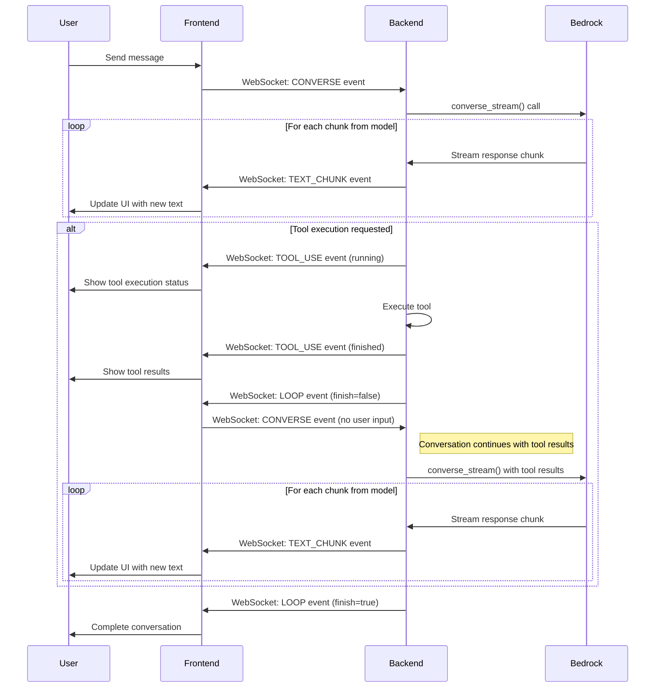

# Conversation Stream Mechanism

This document explains how the conversation streaming mechanism works in the Playground application, particularly focusing on how the backend's `converse_stream` function interacts with the frontend to create a seamless, interactive conversation experience.

## Overview

The Playground application uses a WebSocket-based architecture to enable real-time, streaming conversations between users and the Bedrock AI model. This architecture allows for:

- Incremental text display as the model generates responses
- Tool execution within conversations
- Interruption of model generation
- Multi-turn conversations with a single user input

## Communication Flow

## Key Components

### 1. WebSocket Communication

The frontend and backend communicate through a WebSocket connection, which allows for bidirectional, real-time communication. The WebSocket messages are structured as events with specific types (e.g., CONVERSE, TEXT_CHUNK, TOOL_USE, LOOP).

### 2. Streaming Response

When the backend receives a CONVERSE event from the frontend, it calls the Bedrock model's `converse_stream` function to get a streaming response. As chunks of text are received from the model, they are immediately sent to the frontend as TEXT_CHUNK events, allowing for incremental display of the model's response.

### 3. Tool Execution Loop

One of the most interesting aspects of the system is how it handles tool execution:

1. If the model requests to use a tool, the backend sends a TOOL_USE event with status "running"
2. The backend executes the tool and sends the results back to the frontend as a TOOL_USE event with status "success" or "error"
3. The backend then sends a LOOP event with `finish=false`
4. When the frontend receives this LOOP event, it automatically sends another CONVERSE event (without user input)
5. The backend receives this new CONVERSE event and continues the conversation with the model, including the results of the tool execution
6. This process can repeat multiple times if the model requests additional tool executions

This creates the appearance of a continuous, multi-turn conversation even though the user only sent a single message.

### 4. Interruption Mechanism

The system also supports interrupting the model's generation:

1. When a user requests an interruption, the frontend sends an INTERRUPT event
2. The backend sets an interruption flag in the session
3. During generation, the backend periodically checks this flag and stops generation if it's set

## Message Framing

To handle large messages that exceed WebSocket payload limits, the system implements a framing mechanism:

1. Large messages are split into multiple frames
2. Each frame includes metadata (frame ID, index, total frames)
3. The frontend reassembles the frames before processing the message

## Conclusion

This architecture enables a responsive, interactive conversation experience where:

- Text appears incrementally as it's generated
- Tools can be executed seamlessly within the conversation
- The user can interrupt generation if needed
- Multiple turns of conversation can happen automatically

All of this happens through a single WebSocket connection, with the frontend and backend coordinating to create the appearance of a continuous conversation flow.
